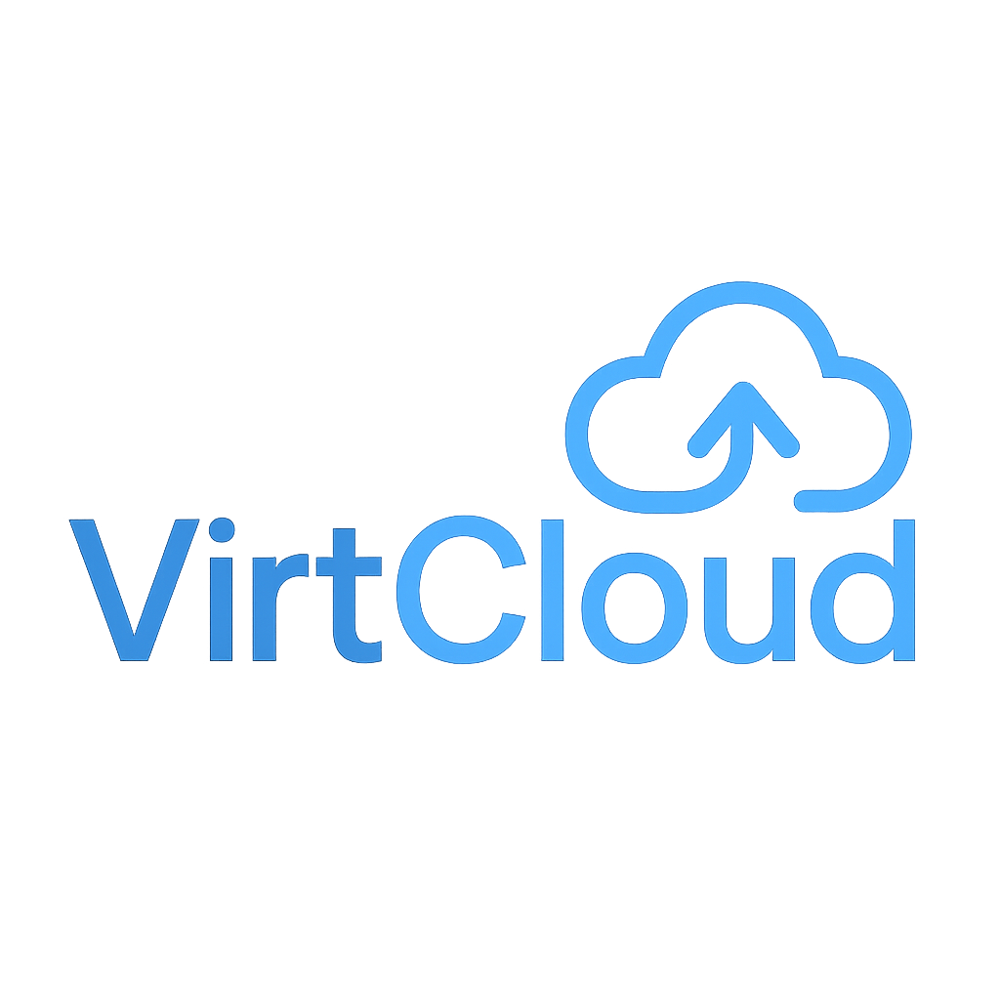

#  VirtCloud

> 🚀 A Web-Based Virtual Machine Management System

[](https://fastapi.tiangolo.com/)
[](https://reactjs.org/)
[](https://www.mongodb.com/)
[](https://mui.com/)
[](https://www.qemu.org/)
[](https://www.docker.com/)

## 🔍 Introduction

VirtCloud is a modern cloud platform that allows users to create, manage, and interact with virtual machines through a fully responsive web interface. Built for educational purposes as a graduation project for a Cloud Computing course, VirtCloud demonstrates how virtualization technologies can be integrated with web technologies to create a comprehensive cloud management system.

The platform enables users to create, resize, convert, and launch virtual machines using a user-friendly interface, with a credit-based billing system to manage resource allocation fairly. VirtCloud leverages the power of QEMU for virtualization, making it possible to run various operating systems directly in your browser.

## ✨ Features

### 💽 Disk Management
- **Create Virtual Disks** in multiple formats (QCOW2, RAW, VHDX, VMDK, VDI)
- **Resize Disks** to accommodate growing storage needs
- **Convert Disks** between different formats while preserving data
- **View Detailed Information** about your disks including usage and format specifics
- **Rename Disks** to keep your workspace organized

### 🖥️ Virtual Machine Management
- **Launch Linux VMs** with ISO support for OS installation
- **Stop and Start VMs** on demand
- **Monitor VM Performance** and resource usage in real-time
- **Edit VM Resources** (CPU, RAM) when VMs are stopped
- **Delete VMs** when no longer needed

### 👤 User Management
- **Secure Authentication** using JWT tokens
- **User Dashboard** with overview of all resources
- **Plan Management** with ability to switch between different subscription tiers

### 💳 Billing & Credits
- **Dynamic Billing** via credit model with per-resource pricing
- **Usage Tracking** with detailed cost breakdowns
- **Plan Restrictions** based on user subscription level
- **Credit Deduction** in real-time as resources are used

## 🧰 Tech Stack

### Frontend
- **React**: Component-based UI development
- **Material UI**: Modern, responsive component library
- **Axios**: HTTP client for API requests
- **Context API**: State management across components

### Backend
- **FastAPI**: Modern, high-performance Python web framework
- **JWT**: JSON Web Tokens for authentication
- **PyMongo**: MongoDB integration for Python
- **QEMU Command Wrappers**: Python interfaces to QEMU virtualization tools

### Database
- **MongoDB**: NoSQL database for flexible, document-based storage

### Virtualization
- **QEMU/KVM**: Open-source machine emulator and virtualizer
- **Docker**: Container integration (planned for Phase 2)

## 💳 Plans & Credit System

VirtCloud operates on a credit-based billing system where different subscription plans offer varying resource limitations and benefits.

### Plan Tiers

| Plan | Price | Monthly Credits | CPU Limit | RAM Limit | Disk Limit |
|------|-------|----------------|-----------|-----------|------------|
| 🟢 **Free** | $0 | 15 credits | 2 cores | 2 GB | 20 GB |
| 🔵 **Pro** | $9 | 150 credits | 4 cores | 8 GB | 50 GB |
| 🟣 **Unlimited** | $29 | 600 credits | 8 cores | 16 GB | 200 GB |
| 🔥 **Pay-As-You-Go** | $0 base | 0 (pay per use) | 8 cores | 16 GB | 200 GB |

### Resource Pricing

- **Base Cost**: 0.5 credits/hour for each VM
- **CPU**: 0.2 credits/core/hour
- **RAM**: 0.1 credits/GB/hour
- **Disk**: 0.05 credits/GB (one-time creation cost)

### Credit System Details

- **Credit Value**: 1 credit = $0.50
- **Credit Deduction**: Automatically calculated and deducted while VMs are running
- **Plan Switching**: Users can upgrade or downgrade their plan at any time
- **Credit Purchase**: Pay-as-you-go users can purchase additional credits when needed

## 🚀 Setup Instructions

### Prerequisites
- Python 3.8+
- Node.js 14+
- MongoDB instance (local or Atlas)
- QEMU installed and configured

### Backend Setup

1. Clone the repository:
   ```bash
   git clone https://github.com/Mostafa-Hesham1/VirtCloud.git
   cd VirtCloud/backend
   ```

2. Create and activate a virtual environment:
   ```bash
   python -m venv venv
   # On Windows
   venv\Scripts\activate
   # On Linux/MacOS
   source venv/bin/activate
   ```

3. Install dependencies using the `requirements.txt` file:
   ```bash
   pip install -r requirements.txt
   ```

4. Create a `.env` file with the following content:
   ```
   SECRET_KEY="your_secret_key_here"
   DB_URL="mongodb://localhost:27017" # or your MongoDB Atlas URL
   ```

5. Ensure QEMU is installed and available in your PATH:
   - On Windows: Install from [QEMU for Windows](https://www.qemu.org/download/#windows)
   - On Linux: `sudo apt install qemu-kvm qemu-utils`

6. Start the backend server:
   ```bash
   uvicorn main:app --reload
   ```

### Frontend Setup

1. Navigate to the frontend directory:
   ```bash
   cd ../frontend
   ```

2. Install dependencies:
   ```bash
   npm install
   ```

3. Start the development server:
   ```bash
   npm start
   ```

4. Access the application at http://localhost:3000

## 🔐 Authentication Guide

VirtCloud uses JWT (JSON Web Tokens) for secure authentication.

### Authentication Flow

1. **User Registration**:
   - Users register with email, username, and password
   - Passwords are securely hashed using bcrypt

2. **User Login**:
   - On successful login, a JWT token is generated and returned
   - Token includes user data such as email, plan, and role
   - Frontend stores token in localStorage

3. **Protected Endpoints**:
   - Protected API endpoints require valid JWT tokens
   - Token is sent in the Authorization header format: `Bearer <token>`

4. **Token Verification**:
   - Backend verifies token signature and expiration
   - Decoded user data is available in the request context

5. **Token Refresh**:
   - The `/auth/me` endpoint validates tokens and returns current user information
   - Frontend can use this to verify session validity

## 🧪 Testing & API Documentation

All backend endpoints are documented using Swagger UI and available at `/docs` when running the backend server.

### Example API Requests

#### Create a Disk
```json
POST /vm/create-disk
{
  "name": "ubuntu_disk",
  "size": "10G",
  "format": "qcow2"
}
```

#### Resize a Disk
```json
POST /vm/resize-disk
{
  "name": "ubuntu_disk.qcow2",
  "resize_by": "+5G"
}
```

#### Launch a VM
```json
POST /vm/create-vm
{
  "disk_name": "ubuntu_disk.qcow2",
  "iso_path": "C:\\path\\to\\ubuntu.iso",
  "memory_mb": 2048,
  "cpu_count": 2,
  "display": "sdl"
}
```

#### User Authentication
```json
POST /auth/login
{
  "email": "user@example.com",
  "password": "securepassword"
}
```


## 👤 Author & Acknowledgments


Developed as part of the Cloud Computing course at MSA University.

## 📜 License

This project is licensed under the MIT License - see the LICENSE file for details.

---

<p align="center">© 2025 VirtCloud - A Cloud Computing Course Project</p>
